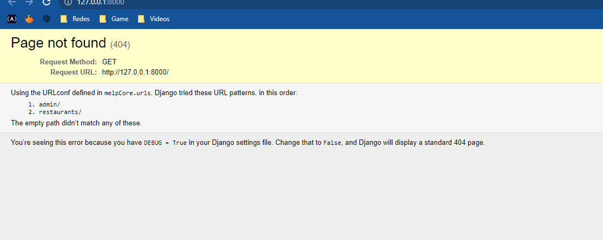

# First we need to install python3
### 1.- To install python we just need to go to the official web cite and download the installer or follow the instruction for the respective system
### 2.- Now just need to install pip3 also install virualenv
```
pip3 install virtualenv
```
### 3.- This is optional but you can use virtualenv to make a new environment just for this project
```
virtualenv name_virtualenv
```
### 4.- To activate the virtualenv we follow this instructions:
#### for windows:
```
. name_virtualenv/scripts/activate
```
#### for linux:
```
. name_virtualenv/bin/activate
```
#### If we want to deactivate the virtualenv just type for all systems:
```
deactivate
```
### 5.- now just need to install the requirements move to the project folder the use this comments:
```
cd Transactions/

pip3 install -r requirements.txt
```
### 6.- execute migrations:
- First this command:
```
python manage.py makemigrations
```
- then this one:
```
python manage.py migrate
```

### 7.- Now we can use this command to install all the dependencies:
```
pip3 install -r requirements.txt
```

### 8.- Next just run the project with:
```
python3 manage.py runserver
```
### 9.- Just type this url in your browser.

```
http://127.0.0.1:8000/
```
# and you will se this page


# Something extra 
### you can use:
```
cd prject_folder/

python manage.py createsuperuser
```
### to create a super user and see the admin page of django and see the data saved in the db.
### just go to:
```
http://127.0.0.1:8000/admin